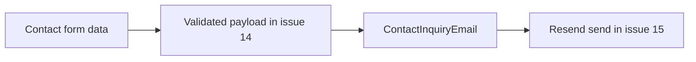

# Plan for Issue #19

## Goal

Create a reusable Athena Digital email foundation that matches the current brand closely enough to feel intentional in the inbox, while staying email-safe and ready for issue `#15` to send through Resend later.

## Boundaries

- In scope: email template structure, reusable branded primitives, one internal inquiry template, and a local preview workflow.
- Out of scope: form submission wiring, server actions, Resend SDK sending, env vars, spam protection, and docs beyond minimal developer guidance.

## Key Decisions

- Use a root-level [emails/](emails/) workspace so `react-email` preview tooling can work cleanly without coupling templates to the app router.
- Build a small email-safe theme layer instead of reusing website UI components directly. The site’s current brand references live in [src/styles/tailwind.css](/Users/tomomilicevic/zProjects/tailwind-plus-studio/studio-ts/src/styles/tailwind.css), [src/components/Logo.tsx](/Users/tomomilicevic/zProjects/tailwind-plus-studio/studio-ts/src/components/Logo.tsx), [src/components/ContactSection.tsx](/Users/tomomilicevic/zProjects/tailwind-plus-studio/studio-ts/src/components/ContactSection.tsx), [src/components/Footer.tsx](/Users/tomomilicevic/zProjects/tailwind-plus-studio/studio-ts/src/components/Footer.tsx), and [src/app/layout.tsx](/Users/tomomilicevic/zProjects/tailwind-plus-studio/studio-ts/src/app/layout.tsx).
- Use system-sans fallbacks in email instead of trying to carry over the local `Mona Sans` webfont setup from [src/styles/tailwind.css](/Users/tomomilicevic/zProjects/tailwind-plus-studio/studio-ts/src/styles/tailwind.css).
- Treat the first template as an internal notification only, with props shaped to the current contact form in [src/app/contact/page.tsx](/Users/tomomilicevic/zProjects/tailwind-plus-studio/studio-ts/src/app/contact/page.tsx).

## Proposed File Shape

- [emails/components/AthenaEmailLayout.tsx](emails/components/AthenaEmailLayout.tsx): shared outer shell, max-width container, spacing rhythm, footer/signoff.
- [emails/components/AthenaEmailTheme.ts](emails/components/AthenaEmailTheme.ts): email-safe tokens for colors, spacing, radii, typography, logo URL constants, and budget label mapping.
- [emails/components/AthenaDetailRow.tsx](emails/components/AthenaDetailRow.tsx): reusable label/value row for inquiry metadata.
- [emails/templates/ContactInquiryEmail.tsx](emails/templates/ContactInquiryEmail.tsx): branded internal inquiry notification template.
- [emails/previews/contact-inquiry-preview.tsx](emails/previews/contact-inquiry-preview.tsx): realistic preview fixture with sample data.
- [package.json](/Users/tomomilicevic/zProjects/tailwind-plus-studio/studio-ts/package.json): add `react-email` dependency and preview script(s).

## Implementation Sequence

1. Add the React Email workspace and preview entrypoint.

   - Install `react-email`.
   - Add a preview script in [package.json](/Users/tomomilicevic/zProjects/tailwind-plus-studio/studio-ts/package.json) so templates can be iterated locally without sending mail.
   - Keep preview tooling isolated from the Next.js app runtime.

2. Extract Athena’s email-safe brand foundation.

   - Mirror the site’s neutral palette, dark-band treatment, rounded CTA feel, and simple editorial hierarchy from [src/styles/tailwind.css](/Users/tomomilicevic/zProjects/tailwind-plus-studio/studio-ts/src/styles/tailwind.css), [src/components/ContactSection.tsx](/Users/tomomilicevic/zProjects/tailwind-plus-studio/studio-ts/src/components/ContactSection.tsx), and [src/components/Footer.tsx](/Users/tomomilicevic/zProjects/tailwind-plus-studio/studio-ts/src/components/Footer.tsx).
   - Simplify anything email-hostile: no `next/image`, no motion, no opacity-dependent UI, no modern layout assumptions.
   - Use hosted/static logo assets derived from [src/components/Logo.tsx](/Users/tomomilicevic/zProjects/tailwind-plus-studio/studio-ts/src/components/Logo.tsx).

3. Build reusable email primitives before the first template.

   - Shared layout shell with logo/header, content container, divider/footer, and optional CTA slot.
   - Detail row component for structured inquiry data.
   - Token module for typography, spacing, border colors, background colors, and reusable copy constants.

4. Implement the first inquiry notification template.
   - Shape props to mirror the current contact form fields from [src/app/contact/page.tsx](/Users/tomomilicevic/zProjects/tailwind-plus-studio/studio-ts/src/app/contact/page.tsx):

```ts
interface ContactInquiryEmailProps {
  name: string;
  email: string;
  company?: string;
  phone?: string;
  message: string;
  budget?: "25" | "50" | "100" | "150";
}
```

- Map budget codes to human-readable labels inside the email layer so issue `#15` can pass raw form values without presentation logic leaking into delivery code.
- Make the message block visually distinct and easy to scan in inbox clients.

5. Add a realistic preview fixture and minimal conventions.
   - Provide one preview file with plausible Athena inquiry content.
   - Add a short note near the email workspace or script naming so future templates follow the same organization pattern.
   - Leave full setup/deployment docs for issue `#17`.

## Validation

- Local `react-email` preview renders successfully.
- Template compiles with TypeScript and linting.
- Logo/images resolve using email-safe URLs or clearly marked placeholders.
- The rendered template remains readable without custom fonts.

## Handoff to Issue #15

The output of this issue should make issue `#15` almost mechanical: it should only need to import `ContactInquiryEmail`, pass validated form data, and call `resend.emails.send({ react: <ContactInquiryEmail ... /> })`.


